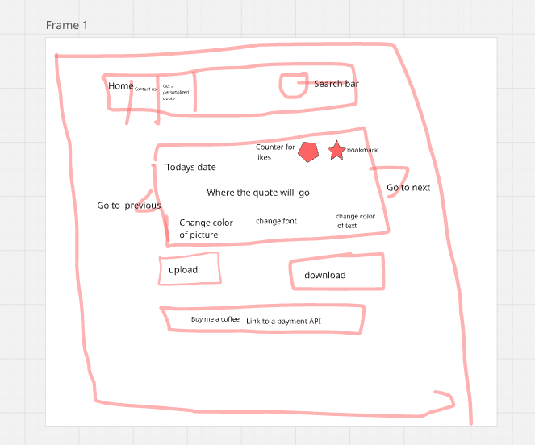

Expectations:

- Design and architect features across a frontend
- Communicate and collaborate in a technical environment
- Integrate JavaScript and an external API
- Debug issues in small- to medium-sized projects - Build and iterate on a project MVP

Delivered:

Project Name 💌
Bible Verse Image Generaor - Single Page Application (SPA)

The user is able to:-

1. Display a verse they like by clicking on it ✅
2. Like a verse ✅
3. Bookmark a verse ✅
4. Delete a verse✅
5. Share a verse ✅
6. Search a verse with a keyword [<<search Box>>] ✖️
7. Filter a verse✖️
8. Upload verse✖️
9. Download a bible verse as a picture✖️
10. Have the option of changing the outline of the picture/format the picture to download✖️
11. Read through Bible verses (<<go next>>)✖️
12. Leave feedback ✖️
    [achieved only the ticked items]

Incorporated the Pillars of dynamic web programming

1. Communicationg with servers
2. DOM Manipulation
3. Event Listening

Used HTTP Methods

- HTTP Methods used
- GET -> retrieves a resource(s)
- POST -> creates a resource
- PATCH/PUT -> update resource
- DELETE -> delete resource from server

Tools 💻

1. Front End - HTML, CSS, and
2. To communicate with external APIs/db.JSON (json-server) - JavaScript

[api data used]("https://bible-api.com/john+3")
[image api]("https://picsum.photos/250/280")

Features of my MVP 🎟️

- Develop my front end using HTML and CSS
- On Javascript

* GET bible data from an API and get access to it
* Create a list items for them
* STRINGYFY the data
* add an event listener when a list item is clicked
* then PARSE the data
* POST data to the db.json
* GET the url data
* PATCH the data to db.json
* Pass a function that creates a verse-card dynamically using
  {add.eventListener(s),
  createElement(s),  
  varibles,
  objects,
  and statemnets }
* Finally display the verse-cards once a list item is clicked.

🔯To work on 🔯

- All unachieved user stories
- Clear my database before adding a new object
- avoid duplication of objects
- have place holders on the web
- reduce loading time

[pitch video](https://drive.google.com/file/d/15UPQSgU58kL1cyQ1peoXgzSDXbonFwwd/view?usp=drive_link)
